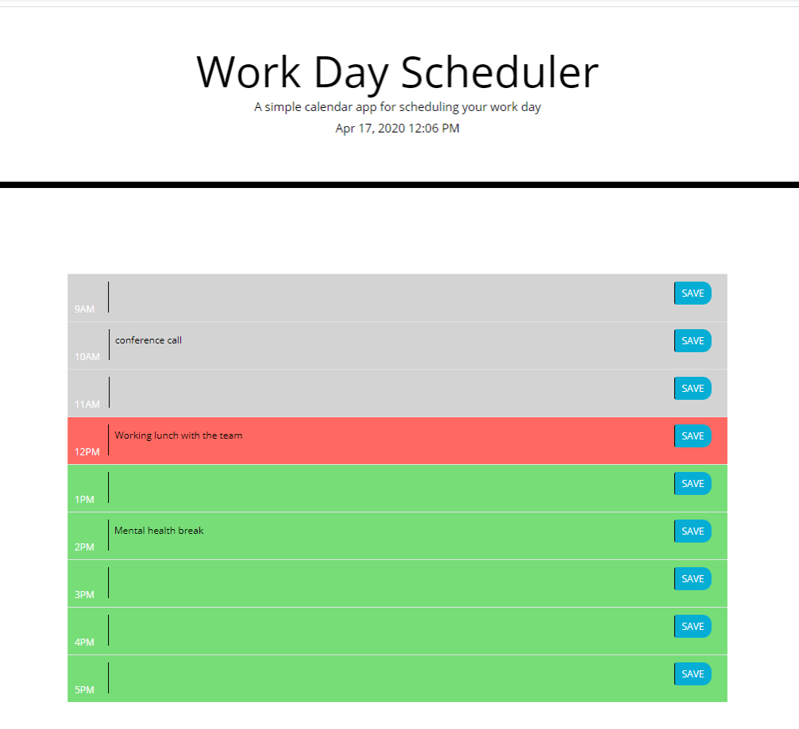

# Work Day Scheduler App
The task is to build a simple calendar application that allows the user to save events for each hour of the day. This app will run in the browser and feature dynamically updated HTML and CSS powered by jQuery. This app should also use moment js to work with date and time.

# How it is Made

This web application uses html, css, moment js, bootstrap grids, and dynamic javascript to render a web based daily calendar scheduler to record tasks. The user is has the option to add their tasks by the hour and save with click of a button. A basic html file was created to display the table of a workday hours and an input with text area to include user input. And finally a save button that will save their taks to local storage. Moment js was used to display the current date and time. Any work hours that are past the current time are styled to show background color of gray, current hour is styled to show red, and future hours on scheduler are styled to show green.

# Web Application Components

A html file containing the basic skeleton was used along with custom css, moment js, and a separate javaScript file. Some boostrap components are used to style grids, buttons and other parts of the application.

# Screenshot


# Other details
Project files: https://github.com/wayele/calendarhw5

Deployed Application link: https://wayele.github.io/calendarhw5


```

## Technologies Used

* Html
* CSS/Bootstrap
* JavaScript

## Author

- Wub
